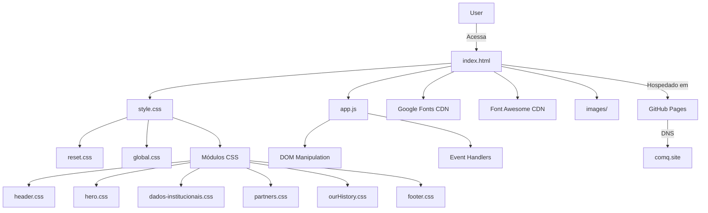
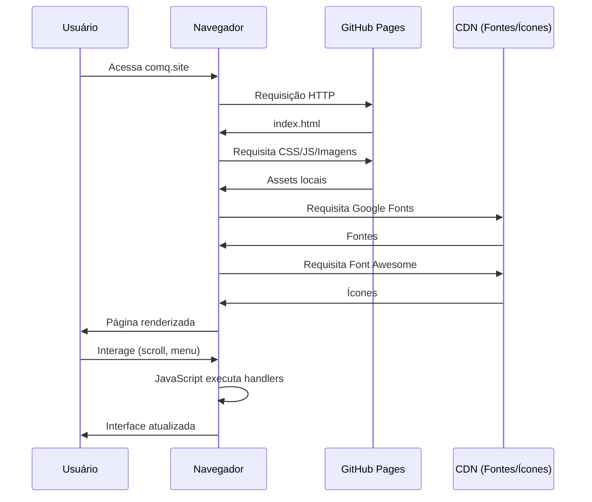

# COMQ - Centro de Oportunidades do Mário Quintana


## 📋 Índice

- [Sobre o Projeto](#-sobre-o-projeto)
- [Visão e Propósito](#-visão-e-propósito)
- [Funcionalidades](#-funcionalidades)
- [Tecnologias Utilizadas](#-tecnologias-utilizadas)
- [Estrutura do Projeto](#-estrutura-do-projeto)
- [Como Executar](#-como-executar)
- [Requisitos Técnicos](#-requisitos-técnicos)
- [Arquitetura](#-arquitetura)
- [Deploy](#-deploy)
- [Contribuindo](#-contribuindo)
- [Equipe](#-equipe)
- [Licença](#-licença)
- [Contato](#-contato)

---

## 🎯 Sobre o Projeto

O **COMQ** (Centro de Oportunidades do Mário Quintana) é um site institucional que representa uma iniciativa social dedicada a conectar jovens e empreendedores do bairro Mário Quintana, em Porto Alegre/RS, a oportunidades de emprego, capacitação e desenvolvimento pessoal e profissional.

### Propósito

Transformar vidas através do acesso a oportunidades, promovendo a redução das desigualdades sociais e contribuindo para o desenvolvimento econômico e social da comunidade.

### Público-Alvo

- **Jovens**: em busca de primeiro emprego, cursos profissionalizantes e orientação de carreira
- **Empreendedores Locais**: que buscam capacitação, networking e oportunidades de crescimento
- **Parceiros Empresariais**: organizações interessadas em responsabilidade social e contratação de talentos locais
- **Voluntários**: profissionais dispostos a contribuir com mentorias, workshops e palestras

---

## 🌟 Visão e Propósito

### Missão

Conectar jovens e empreendedores do bairro Mário Quintana a oportunidades de desenvolvimento pessoal e profissional, promovendo a transformação social através da educação e do trabalho.

### Visão

Ser reconhecido como um centro de referência em geração de oportunidades, contribuindo para a redução das desigualdades sociais e o desenvolvimento de renda da comunidade.

### Valores

- Compromisso com a comunidade
- Inclusão e diversidade
- Inovação e criatividade
- Colaboração e trabalho em rede

---

## ⚡ Funcionalidades

### 1. Navegação Responsiva
- Header fixo com menu hamburger para dispositivos móveis
- Navegação suave entre seções (smooth scroll)
- Menu overlay com acessibilidade (ARIA labels)

### 2. Apresentação Institucional
- Seção Hero com chamada para ação
- Dados institucionais (Missão, Visão, Valores)
- Timeline com histórico de conquistas
- Galeria de parceiros

### 3. Engajamento da Comunidade
- Cards com depoimentos de membros da comunidade
- Links diretos para grupos do WhatsApp:
  - Grupo de Jovens
  - Grupo de Empreendedoras

### 4. Captação de Recursos Humanos
- **Seja um Parceiro**: convite para empresas contribuírem com vagas, patrocínios ou mentorias
- **Seja um Voluntário**: formulário de inscrição via Google Forms
- Contatos diretos via WhatsApp e e-mail

### 5. Informações de Contato
- Footer completo com dados de localização
- Links para redes sociais (Instagram, LinkedIn)
- Formulário de newsletter (frontend pronto)

---

## 🛠 Tecnologias Utilizadas

### Frontend

| Tecnologia | Versão | Propósito |
|------------|--------|-----------|
| HTML5 | - | Estrutura semântica e acessível |
| CSS3 | - | Estilização modular e responsiva |
| JavaScript (Vanilla ES6+) | - | Interatividade e manipulação do DOM |

### Bibliotecas Externas (CDN)

| Biblioteca | Versão | Uso |
|------------|--------|-----|
| Google Fonts | - | Tipografia (Barlow Condensed, Nunito) |
| Font Awesome | 6.4.0 | Ícones de interface e redes sociais |

### Ferramentas de Desenvolvimento

- **Editor de Código**: Visual Studio Code
- **Controle de Versão**: Git
- **Hospedagem**: GitHub Pages
- **Domínio**: comq.site

---

## 📁 Estrutura do Projeto

```
site_comq/
├── .git/                          # Repositório Git
├── .vscode/                       # Configurações do VS Code
│   └── settings.json
├── .claude/                       # Configurações da IA Claude
│   └── settings.local.json
├── css/                           # Folhas de estilo modulares
│   ├── reset.css                  # Reset CSS (Meyer Reset)
│   ├── global.css                 # Variáveis e estilos globais
│   ├── header.css                 # Cabeçalho e navegação
│   ├── hero.css                   # Seção hero/banner
│   ├── dados-institucionais.css   # Missão, Visão, Valores
│   ├── partners.css               # Seção de comunidade
│   ├── ourHistory.css             # Timeline de história
│   ├── footer.css                 # Rodapé
│   └── style.css                  # Arquivo de importação principal
├── images/                        # Assets visuais (~3 MB)
│   ├── logo-comq.png              # Logo principal
│   ├── hero-bg.webp               # Background da hero
│   ├── *.png                      # Ícones e logos de parceiros
│   └── *.jpeg/*.webp              # Fotos de eventos e pessoas
├── js/                            # Scripts JavaScript
│   └── app.js                     # Lógica principal (130 linhas)
├── CNAME                          # Configuração de domínio customizado
├── index.html                     # Página principal (538 linhas)
└── README.md                      # Documentação do projeto
```

### Organização do CSS

O CSS segue uma arquitetura **modular por componente/seção**:

1. **reset.css**: Normalização de estilos entre navegadores
2. **global.css**: Variáveis CSS (cores, fontes) e estilos base
3. **Arquivos específicos**: Um arquivo por seção/componente do site
4. **style.css**: Orquestrador que importa todos os módulos

### Convenções de Nomenclatura

- **CSS Classes**: BEM-like (ex: `.hero__container`, `.partner-card`)
- **Variáveis CSS**: Prefixo `--color-` e `--font-`
- **Arquivos**: kebab-case (ex: `dados-institucionais.css`)

---

## 🚀 Como Executar

### Pré-requisitos

- Navegador web moderno (Chrome, Firefox, Edge, Safari)
- (Opcional) Servidor HTTP local para desenvolvimento

### Execução Local

#### Opção 1: Abrir diretamente no navegador

1. Clone ou faça download do repositório
2. Navegue até a pasta do projeto
3. Abra o arquivo `index.html` diretamente no navegador

#### Opção 2: Servidor HTTP Local (Recomendado)

**Com Python:**
```bash
# Python 3
python -m http.server 8000

# Acesse: http://localhost:8000
```

**Com Node.js (npx):**
```bash
npx serve .

# ou

npx http-server -p 8000
```

**Com Live Server (VS Code):**
1. Instale a extensão "Live Server" no VS Code
2. Clique com botão direito em `index.html`
3. Selecione "Open with Live Server"

---

## 💻 Requisitos Técnicos

### Navegadores Suportados

| Navegador | Versão Mínima |
|-----------|---------------|
| Chrome | 90+ |
| Firefox | 88+ |
| Safari | 14+ |
| Edge | 90+ |
| Opera | 76+ |

### Recursos Utilizados

- **CSS Grid** e **Flexbox**: Layout responsivo
- **CSS Custom Properties**: Variáveis para temas
- **ES6+ JavaScript**: Arrow functions, const/let, template literals
- **Media Queries**: Breakpoints em 768px, 1024px, 1200px
- **Lazy Loading**: Carregamento otimizado de imagens
- **ARIA Attributes**: Acessibilidade para leitores de tela

---

## 🏗 Arquitetura

### Estilo Arquitetural

**Site Estático Tradicional** (HTML/CSS/JS Vanilla)

- **Tipo**: Single Page Application (SPA) simplificada com navegação por âncoras
- **Padrão**: Component-based sem framework
- **Abordagem**: Progressive Enhancement (funciona sem JavaScript)

### Diagrama de Arquitetura



### Fluxo de Dados



### Padrões de Design Implementados

1. **Module Pattern** (JavaScript)
   - Encapsulamento via constantes e funções
   - Namespace implícito com `DOM_ELEMENTS`

2. **BEM-like CSS**
   - Nomenclatura descritiva e hierárquica
   - Exemplo: `.hero__container`, `.partner-card`

3. **Mobile-First** (parcial)
   - Media queries `min-width` em algumas seções
   - Design responsivo em todas as páginas

4. **Progressive Enhancement**
   - Site funcional mesmo sem JavaScript
   - JavaScript adiciona melhorias (menu, scroll effects)

5. **Separation of Concerns**
   - HTML para estrutura
   - CSS para apresentação (modularizado)
   - JavaScript para comportamento

---

## 🌐 Deploy

### Hospedagem Atual

**Plataforma**: GitHub Pages
**Domínio**: [comq.site](http://comq.site)
**DNS**: Configurado via arquivo `CNAME`

### Processo de Deploy

1. **Push para repositório Git**
   ```bash
   git add .
   git commit -m "Atualização do site"
   git push origin main
   ```

2. **GitHub Pages** automaticamente:
   - Detecta alterações na branch `main`
   - Publica os arquivos estáticos
   - Atualiza o site em poucos minutos

### Configuração do Domínio Customizado

O arquivo `CNAME` contém:
```
comq.site
```

Isso permite que o GitHub Pages sirva o site no domínio customizado em vez do padrão `username.github.io`.

---

## 🤝 Contribuindo

### Como Contribuir

1. **Fork** o repositório
2. Crie uma **branch** para sua feature:
   ```bash
   git checkout -b feature/minha-feature
   ```
3. **Commit** suas alterações:
   ```bash
   git commit -m "feat: adiciona nova funcionalidade X"
   ```
4. **Push** para a branch:
   ```bash
   git push origin feature/minha-feature
   ```
5. Abra um **Pull Request**

### Convenções de Commit

Utilize [Conventional Commits](https://www.conventionalcommits.org/):

- `feat:` Nova funcionalidade
- `fix:` Correção de bug
- `docs:` Alterações em documentação
- `style:` Formatação, ponto e vírgula, etc.
- `refactor:` Refatoração de código
- `test:` Adição ou correção de testes
- `chore:` Manutenção geral

### Padrões de Código

- **HTML**: Semântico, com atributos ARIA para acessibilidade
- **CSS**: Modular, BEM-like, mobile-first
- **JavaScript**: ES6+, comentários descritivos, funções puras
- **Indentação**: 2 espaços
- **Aspas**: Duplas para strings

---

## 👥 Equipe

### Organização

**COMQ - Centro de Oportunidades do Mário Quintana**

### Contatos

- **E-mail**: comq.projeto@gmail.com
- **WhatsApp**: +55 51 8907-3820
- **Instagram**: [@comq.projeto](https://www.instagram.com/comq.projeto/)
- **LinkedIn**: [COMQ Projeto](https://www.linkedin.com/company/comq-projeto/)

### Localização

Bairro Mário Quintana
Porto Alegre/RS - Brasil

---

## 📄 Licença

Este projeto é de propriedade do **Centro de Oportunidades do Mário Quintana (COMQ)**.

Todos os direitos reservados © 2024-2025 COMQ.

Para uso, modificação ou distribuição, entre em contato com a organização.

---

## 📞 Contato

### Para Empresas (Parcerias)
- **WhatsApp**: [+55 51 98438-6201](https://wa.me/5551984386201)

### Para Voluntários
- **Formulário**: [Inscrição de Voluntários](https://docs.google.com/forms/d/e/1FAIpQLScJdvSavlrLVEg4owRK8hGunAH886zovvgiHbrnvE6mGTMuvA/viewform)

### Para Jovens
- **Grupo WhatsApp**: [Entrar no Grupo de Jovens](https://chat.whatsapp.com/IEoF66GNAYq1VtF02pPiy5)

### Para Empreendedoras
- **Grupo WhatsApp**: [Entrar no Grupo de Empreendedoras](https://chat.whatsapp.com/B6ZCV0jxCsY07b8X8Rkf3N)

---

## 📊 Estatísticas do Projeto

| Métrica | Valor |
|---------|-------|
| Linhas de HTML | 538 |
| Linhas de CSS | 1.689 |
| Linhas de JavaScript | 130 |
| Total de Linhas | 2.357 |
| Tamanho de Imagens | ~3 MB |
| Arquivos CSS | 9 |
| Arquivos de Imagem | 33 |

---

## 🔗 Links Úteis

- [Site Oficial](http://comq.site)
- [Instagram](https://www.instagram.com/comq.projeto/)
- [LinkedIn](https://www.linkedin.com/company/comq-projeto/)
- [Formulário de Voluntários](https://docs.google.com/forms/d/e/1FAIpQLScJdvSavlrLVEg4owRK8hGunAH886zovvgiHbrnvE6mGTMuvA/viewform)

---

**Última atualização**: Novembro de 2025
**Versão**: 1.0.0

---

*Transformando vidas através de oportunidades desde 2024* ✨
